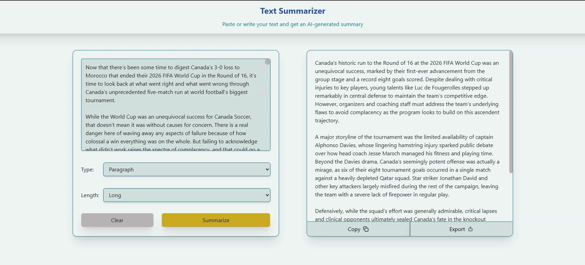

# AI Text Summarizer
An AI text summarizer that uses Google's Gemini API to summarize pasted or typed text. Users can choose the summary format and length. The website is responsive and works on all screen sizes.

## Demo

[Demo Video](./media/demo.mp4)

## Frontend
- React
- Tailwind CSS
- Vite
- jsPDF

## Backend
- Node.js
- Express.js

## Features
- AI-generated summaries
- Choose between paragraph and bullet point summaries
- Select the summary length
- Copy summaries to clipboard
- Export summaries as PDFs
- Responsive design
